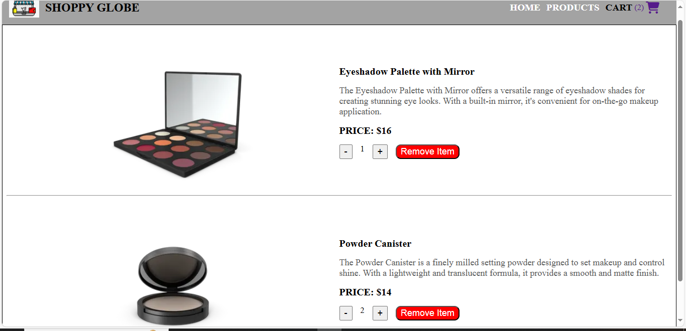

# Shoppy Globe – E-commerce Web Application
Shoppy Globe is a responsive e-commerce web application that allows users to browse products and manage their shopping cart efficiently. Users can add items to the cart, remove them, and adjust quantities as per their requirements. The application is designed to provide a smooth and intuitive user experience with efficient state management for all cart operations.

## Features
- Add to Cart: Users can add products to their shopping cart from the product listing or detail pages.
- Remove from Cart: Items can be removed from the cart with a single click.
- Update Quantity: Users can increase or decrease item quantities directly in the cart.
- Real-time Cart Updates: The cart reflects all changes instantly for a smooth user experience.
- Product Browsing: Clean UI for browsing and viewing product details by category.
- Search Functionality: Search products by title or author for quick access (if implemented).
- State Management: Efficiently handled using Redux Toolkit for reliable global state control.
- Client-Side Routing: Managed with React Router DOM for seamless navigation between pages.

## Project Setup Instructions
### 1. Clone the repository
```bash
git clone https://github.com/Anshulsharma82/Shoppy_Globe_ecommerce_react.git
cd Shoppy_Globe_ecommerce_react
```
### 2. Install Dependencies
```bash
npm install
```

## How to run locally
```bash
npm run dev
```
Then open http://localhost:5173 in your browser.

## Screenshots



## Github Link
https://github.com/Anshulsharma82/Shoppy_Globe_ecommerce_react.git